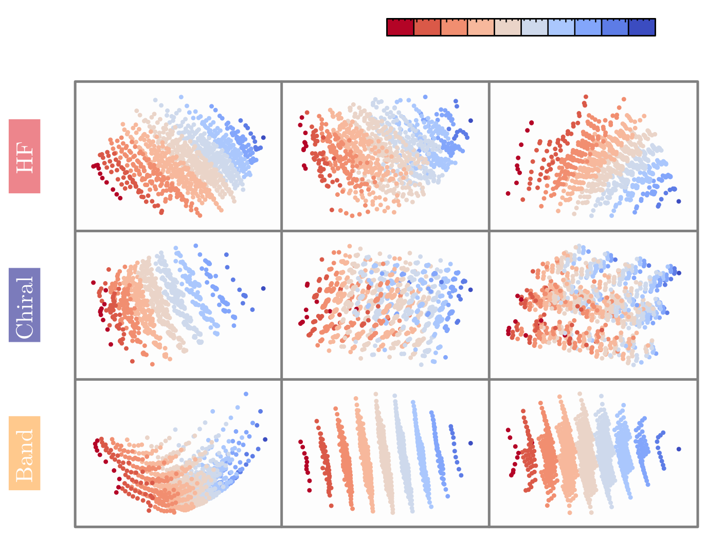

# Physics-informed Transformer for Electronic Quantum States

<p align="center">

</p>

---

This repository contains all the scripts used to generate and analyze the data in the paper "Physics-informed Transformer for Electronic Quantum States".


**Authors:** João Augusto Sobral (University of Stuttgart), Michael Perle (University of Innsbruck) and Mathias S. Scheurer (University of Stuttgart).

The main code is adapted from [Yuanhangzhang98/transformer_quantum_state](https://github.com/yuanhangzhang98/transformer_quantum_state) and [nikhilvyas/SOAP](https://github.com/nikhilvyas/SOAP).

João is thankful for insightful discussions with Yuan-Hang Zhang (also for making his code for the transformer_quantum_state open source).

If you have any questions please reach out to joao.sobral@itp3.uni-stuttgart.de.

---

- [Install from Github](#install-from-github)
- [Short Instructions](#short-instructions)
- [Citation](#citation)
- [License](#license)


## Install from Github

```bash
git clone https://github.com/joaosds/PITransf.git
cd PITransf
```

### Environment Setup

You can set up the environment in different ways: using conda (e.g. with mamba) or virtualenv. We recommend the last one. First, make sure you have virtualenv installed, then: 

1. **Create virtual environment:**
```bash
python -m venv pitransf
```

2. **Activate the environment:**
   - **Linux/Mac:**
     ```bash
     source pitransf/bin/activate
     ```
   - **Windows:**
     ```bash
     pitransf\Scripts\activate
     ```

3. **Install dependencies:**
```bash
# Upgrade pip first
pip install --upgrade pip

# Install all dependencies from requirements.txt
pip install -r requirements.txt
```

## Short Instructions

### Basic Usage

Run with default parameters ($N_{e}=6$, $t/U=0.18$ and hf-basis):
```bash
./main.sh
```

To run with custom parameters, please edit the "config.sh" file. This file already explains each of the parameters, but here are some additional comments with the 
corresponding notation on the main text:

- `N`: System size (number of electrons) ($N_{e}$).
- `t`: Hopping parameter  ($t/U$).
- `basis`: Basis type (`"hf"`, `"chiral"`, or `"band"`).
- `niter`: Training iterations (Epochs).
- `embedding_size`: Embedding dimension ($d_{\text{emb}}$).
- `ndec_layer`: Number of transformer decoder layers ($N_{\text{dec}}$).
- `nhead`: Number of transformer attention heads ($N_{\text{h}}$).
- `nunique`: Number of unique states for the batch-autoregressive sampler ($N_{u}$). Note that if $N_{u} < 2^{N_{e}}$, $n_{u}^{f}$ may still be greater than $N_{u}$ in certain cases. See ref. [38] on the main text for more details.
- `nbatch`: Batch size for the batch-autoregressive sampler ($N_{s}$).
- `sec_batch`: Parallel batch size. This divides the total number of local energy estimators to be processed in parallel. This option is quite useful when running the code on a GPU, especially when using either the chiral or band bases. For small tests, you can set it to 1.
- `identifier`: String identifier for the plots and result files.

### Project Structure

```
.
├── main.sh                          # Main execution script
├── config.sh                        # Configuration template
├── requirements.yml		     # Python environment
├── hartree-fock/                    # HF calculation code
├── transformer_quantum_state/       # Transformer code
│   ├── main.py                      # Main transformer script
│   ├── plot.py                      # Plotting functions
│   ├── model.py                     # Transformer model
│   ├── Hamiltonian.py              # Hamiltonian definitions
│   └── optimizer.py                # Optimization routines
└── results/                         # Output directory
```


## Citation

If you use this code in your work, please cite the associated paper with:

```bibtex
@article{Sobral2024Dec,
	author = {Sobral, Jo{\ifmmode\tilde{a}\else\~{a}\fi}o Augusto and Perle, Michael and Scheurer, Mathias S.},
	title = {{Physics-informed Transformers for Electronic Quantum States}},
	journal = {arXiv},
	year = {2024},
	month = dec,
	eprint = {2412.12248},
	doi = {10.48550/arXiv.2412.12248}
}
```

In this case, please also cite the original Transformer Quantum State paper:

```bibtex
@article{Zhang2023Feb,
	author = {Zhang, Yuan-Hang and Di Ventra, Massimiliano},
	title = {{Transformer quantum state: A multipurpose model for quantum many-body problems}},
	journal = {Phys Rev B},
	volume = {107},
	number = {7},
	pages = {075147},
	year = {2023},
	month = feb,
	publisher = {American Physical Society},
	doi = {10.1103/PhysRevB.107.075147}
}
```
## License

Shield: [![CC BY 4.0][cc-by-shield]][cc-by]

This work is licensed under a [Creative Commons Attribution 4.0 International License][cc-by].

[![CC BY 4.0][cc-by-image]][cc-by]

[cc-by]: http://creativecommons.org/licenses/by/4.0/
[cc-by-image]: https://i.creativecommons.org/l/by/4.0/88x31.png
[cc-by-shield]: https://img.shields.io/badge/License-CC%20BY%204.0-lightgrey.svg
